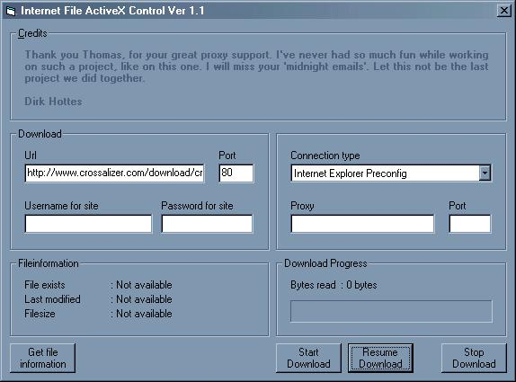



## Internet File Control \(File Properties and Download, with Resume Function\) UPDATED\!

### Description

This control download a given Url to a local file. You can stop the download process on any time and resume it later. With this control you can also get information, like filesize, last modification date and if the file exists, about an given url. This control doesn't use any ActiveX control. Code is completly written with WinInet Api.
 
### More Info
 

             |
---                |---
**Submitted On**   |2000-08-10 15:20:04
**By**             |[Dirk Hottes](https://github.com/Planet-Source-Code/PSCIndex/blob/master/ByAuthor/dirk-hottes.md)
**Level**          |Advanced
**User Rating**    |4.6 (106 globes from 23 users)
**Compatibility**  |VB 4\.0 \(32\-bit\), VB 5\.0, VB 6\.0
**Category**       |[Internet/ HTML](https://github.com/Planet-Source-Code/PSCIndex/blob/master/ByCategory/internet-html__1-34.md)
**World**          |[Visual Basic](https://github.com/Planet-Source-Code/PSCIndex/blob/master/ByWorld/visual-basic.md)
**Archive File**   |[CODE\_UPLOAD88198102000\.zip](https://github.com/Planet-Source-Code/dirk-hottes-internet-file-control-file-properties-and-download-with-resume-function-update__1-10403/archive/master.zip)

